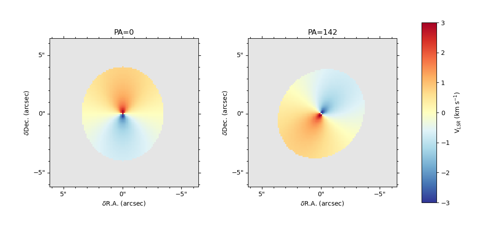

.. _doc_velocity_fields:

Velocity fields
===============

We can create the Keplerian velocity field for a given mass and radius.
The function ``keplerian_field`` calculates the Keplerian velocity field 
for a given mass and the position (radius and position angle) array.
The position angle is the angle between the North and the major axis 
of the disk towards the highest velocity (red-shifted).
The function is used as follows:

.. code-block:: python

    from velocity_tools import keplerian_field
    from velocity_tools.coordinate_offsets import generate_offsets
    from astropy import units as u
    from astropy.io import fits
    import numpy as np
    import matplotlib.pyplot as plt
    from astropy.wcs import WCS
    from astropy.visualization.wcsaxes import WCSAxesSubplot
    from astropy.coordinates import SkyCoord
    plt.ion()
    color_map = plt.get_cmap('RdYlBu_r').copy()
    color_map.set_bad(color='0.9')

    def style_delta(ax) -> None:
        RA = ax.coords[0]
        DEC = ax.coords[1]
        RA.set_ticks_visible(False)
        RA.set_ticklabel_visible(False)
        DEC.set_ticks_visible(False)
        DEC.set_ticklabel_visible(False)
        RA.set_axislabel("")
        DEC.set_axislabel("")

        overlay_coord = ax.get_coords_overlay(off_frame)
        ra_offset = overlay_coord["lon"]
        dec_offset = overlay_coord["lat"]
        ra_offset.set_axislabel(r"$\delta$R.A. (arcsec)")
        dec_offset.set_axislabel(r"$\delta$Dec. (arcsec)")
        ra_offset.set_major_formatter("s")
        dec_offset.set_major_formatter("s")
        ra_offset.set_ticks_position("bt")
        ra_offset.set_ticklabel_position("b")
        dec_offset.set_ticks_position("lr")
        dec_offset.set_ticklabel_position("l")
        ra_offset.set_axislabel_position("b")
        dec_offset.set_axislabel_position("l")
        ra_offset.display_minor_ticks(True)
        dec_offset.display_minor_ticks(True)
        dec_offset.set_minor_frequency(5)
        ra_offset.set_minor_frequency(5)
        dec_offset.set_ticks(spacing=5 * u.arcsec, color="black")
        ra_offset.set_ticks(spacing=5 * u.arcsec, color="black")
        return

    data = np.zeros((101, 101))
    hdu = fits.PrimaryHDU(data=data)
    # coordinates targeted by the GOTHAM survey
    ra0 = 70.4270833 * u.deg
    dec0 = 25.6907778 * u.deg
    off_frame = center_coord.skyoffset_frame()
    inc0 = 30 * u.deg
    center_coord = SkyCoord(ra0, dec0, frame='fk5')
    # pixel of 0.1 arcsec
    hdu.header['CDELT1'] = -0.125 * u.arcsec.to(u.deg)
    hdu.header['CDELT2'] = 0.125 * u.arcsec.to(u.deg)
    hdu.header['CRPIX1'] = 50
    hdu.header['CRPIX2'] = 50
    hdu.header['CRVAL1'] = ra0.value
    hdu.header['CRVAL2'] = dec0.value
    hdu.header['CTYPE1'] = 'RA---TAN'
    hdu.header['CTYPE2'] = 'DEC--TAN'
    hdu.header['CUNIT1'] = 'deg'
    hdu.header['CUNIT2'] = 'deg'
    hdu.header['EQUINOX'] = 2000.0
    mass = 1.0 * u.Msun  # Mass in solar masses
    
    # Calculate velocity field
    results = keplerian_field.generate_Vlsr(
        hdu.header, ra0, dec0, PA_Angle=0.*u.deg, inclination=inc0, 
        distance=100.0*u.pc, R_out=400*u.au, Mstar=mass, 
        Vc=0*u.km/u.s, do_plot=False)
    
    results2 = keplerian_field.generate_Vlsr(
        hdu.header, ra0, dec0, PA_Angle=142.*u.deg, inclination=inc0, 
        distance=100.0*u.pc, R_out=400*u.au, Mstar=mass, 
        Vc=0*u.km/u.s, do_plot=False)
    # Plot the velocity field
    wcs_Vlsr = WCS(hdu.header)
    # create figure
    fig = plt.figure(1, figsize=(11, 5))
    ax0 = WCSAxesSubplot(fig, [0.1, 0.1, 0.3, 0.8], wcs=wcs_Vlsr)
    ax1 = WCSAxesSubplot(fig, [0.5, 0.1, 0.3, 0.8], wcs=wcs_Vlsr)
    fig.add_axes(ax0)
    fig.add_axes(ax1)
    im0 = ax0.imshow(
        results.v,
        origin="lower",
        interpolation="None",
        cmap=color_map,
        alpha=1.0,
        vmin=-3, vmax=3, 
        transform=ax0.get_transform(wcs_Vlsr),
    )
    im1 = ax1.imshow(
        results2.v,
        origin="lower",
        interpolation="None",
        cmap=color_map,
        alpha=1.0,
        vmin=-3, vmax=3, 
        transform=ax1.get_transform(wcs_Vlsr),
    style_delta(ax0)
    style_delta(ax1)
    plt.show()
    # Add colorbar
    cbar_ax = fig.add_axes([0.85, 0.1, 0.03, 0.8])  # [left, bottom, width, height]
    cbar = fig.colorbar(im0, cax=cbar_ax)
    cbar.set_label(r'V$_{LSR}$ (km s$^{-1}$)')
    ax0.set_title('PA=0')
    ax1.set_title('PA=142')

    
    The left and right panel differ only in the position angle used.
    