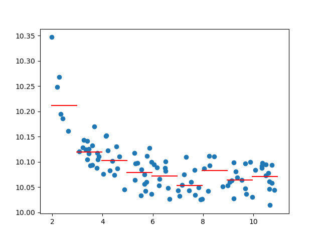

.. _doc_offset_rotation:

Offsets and calculations using the spatial information
======================================================

Offsets and Sky rotation calculation
------------------------------------

The offsets are calculated using the FITS header and by providing 
a sky coordinate to define the center of the image. 
The offsets are calculated using the ``SkyCoord`` and 
``Sky Offset`` framework from `astropy <https://docs.astropy.org/en/stable/coordinates/matchsep.html#sky-offset-frames>`_.
The useage is as follows:

.. code-block:: python

    from velocity_tools.coordinate_offsets import generate_offsets
    from astropy.io import fits
    from astropy.coordinates import SkyCoord

    # Load the FITS file
    hdul = fits.open('my_map_TMC1.fits')
    header = hdul[0].header

    # coordinates targeted by the GOTHAM survey
    ra_TMC1 = 70.4270833 * u.deg
    dec_TMC1 = 25.6907778 * u.deg
    pa_TMC1 = -32 * u.deg
    
    # Calculate offsets
    offsets = generate_offsets(header, ra0, dec0, frame='fk5',
                     pa_angle=0.*u.deg, inclination=0.*u.deg)
    
    offset_rot = generate_offsets(header, ra0, dec0, frame='fk5',
                     pa_angle=pa_TMC1, inclination=0.*u.deg)

The example calculates the offsets for a FITS file with a given RA and DEC
coordinate. The first calculation uses a position angle of 0 degrees, 
which gives the RA and Dec offsets, while the second calculation shows 
the offsets along the TMC1 filament orientation.

The function further allows to calculate the deprojected offsets by providing 
the inclination angle of the structure. The inclination angle is defined as 
the angle between the plane of the sky and the plane of the structure, with 
inclination = 0 being face-on. This is useful for calculating the offsets 
in disks.
The position angle is measured from North to East (counter-clockwise on the sky).

Average profiles
----------------

The function ``average_profiles`` calculates the average profile for 
an array measurements. The function is used as follows:

.. code-block:: python

    from velocity_tools.coordinate_offsets import average_profile
    import numpy as np
    import matplotlib.pyplot as plt
    plt.ion()
    
    # Generate some data
    n_sample = 100
    x_axis = 1 + 10 * np.random.rand(n_sample)
    y_axis = 10 + x_axis**-2 + np.random.rand(n_sample) * 0.1

    # Calculate the average profile
    xbin, ybin, dxbin, dybin = average_profile(x_axis, y_axis, dx=1.0)
    for i in range(len(xbin)):
        xi = [xbin[i] - dxbin[i], xbin[i] + dxbin[i]]
        plt.plot(xi, [ybin[i], ybin[i]], color='red')
    plt.scatter(x_axis, y_axis)
    plt.show()

    Example of average profile calculation using the ``average_profile`` function.
    The data points are shown in blue, while the average profile is shown in red.

The function calculates the average profile of the data in the ``x_axis`` and 
provides the average value in the ``y_axis``. The function also provides the
uncertainty in the average value, which is calculated as the standard deviation
of the data in each bin.
The profile can also be calculated in logarithmic space by setting the 
``log`` parameter to ``True``.

Masks defined in Velocity
-------------------------

The function ``mask_velocity`` calculates the mask for a given data cube 
using a velocity map and linewidth.
It takes a `SpectralCube <https://spectral-cube.readthedocs.io/>`_ object 
(data cube) and a velocity map as input. 
A mask is created at each pixel center on the velocity from the 
velocity map it includes all channels within a separation of 
``linewidth`` of the velocity map. It returns a boolean mask with the
same shape as the data cube, which is useful for lines with a single 
Gaussian component.
The function is used as follows to create an improved 
integrated intensity map:

.. code-block:: python

    from velocity_tools.coordinate_offsets import mask_velocity
    from spectral_cube import SpectralCube
    import numpy as np
    from astropy import units as u
    from astropy.io import fits
    import matplotlib.pyplot as plt
    plt.ion()

    # Generate some data
    cube = SpectralCube.read('my_cube.fits')
    vmap = fits.getdata('my_velocity_map.fits') * u.km/u.s
    mask = mask_velocity(cube, vmap, linewidth=1.0*u.km/u.s)

    cube = cube.with_mask(mask)
    moment0 = cube.moment0(axis=0)

