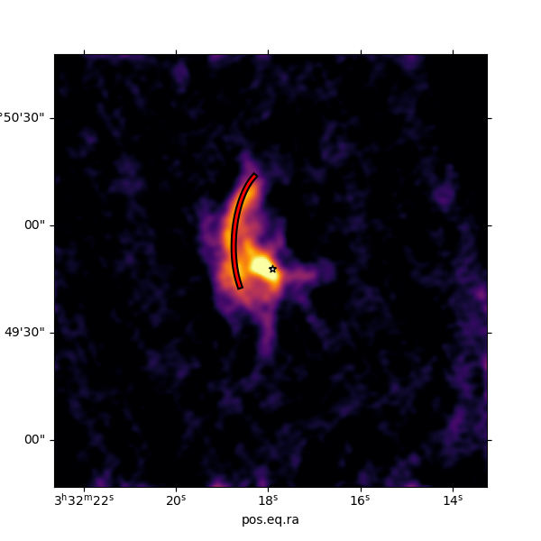
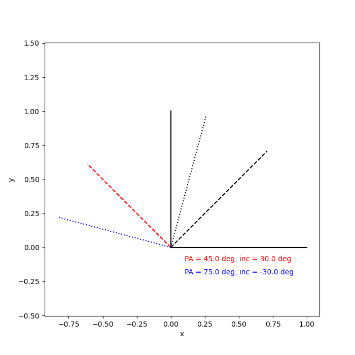

.. _doc_streamline:

Streamline model
================

This module calculates the streamline model using the formalism of `Mendoza et al. (2009) <https://ui.adsabs.harvard.edu/abs/2009MNRAS.393..579M>`_.
This module was created for the `Pineda et al. (2020) <https://ui.adsabs.harvard.edu/abs/2020NatAs...4.1158P>`_ paper.

The model calculates the streamline model under the influence of gravity from the 
central region (constant throughout the calculation), where the parcel of 
gas starts at a given position (radius, and spherical angles: theta and phi).
This trajetory is further rotated by the inclination and position angle 
to obtain a trajectory that can be directly compared with the data.

Setting up the streamline model
-------------------------------
In this implementation, the x-axis corresponds to -(RA), 
the z-axis to Dec, 
and the y-axis to the line of sight.
This is an example of how to setup the streamline model:

.. code:: python
    
    import os
    import matplotlib.pyplot as plt
    from velocity_tools import stream_lines
    from astropy import units as u
    from astropy.wcs import WCS
    from astropy.coordinates import SkyCoord, FK5
    from astropy.visualization.wcsaxes import WCSAxes
    from astropy.io import fits
    plt.ion()
    #
    Per2_c = SkyCoord("3h32m17.92s", "+30d49m48.03s", frame='fk5')
    Per2_ref = Per2_c.skyoffset_frame()

    distance = 300
    file_TdV = 'Per-emb-2-HC3N_10-9_TdV.fits'
    # The file can be downloaded from:
    if not os.path.isfile(file_TdV):
        import urllib.request
        link_file = 'https://github.com/jpinedaf/NOEMA_streamer_analysis/raw/eb3908e651e00dc9f110a8e82304222b83bb51fe/data/Per-emb-2-HC3N_10-9_TdV.fits'
        urllib.request.urlretrieve(link_file, filename=file_TdV)

    # Create the streamline model
    theta0 = 130.*u.deg
    r0 = 0.9e4*u.au
    phi0 = 365.*u.deg
    v_r0 = 0*u.km/u.s
    omega0 = 4e-13/u.s
    v_lsr = 7.05*u.km/u.s
    inc = -43*u.deg
    PA_ang = 130*u.deg
    Mstar = 3.2*u.Msun
    # these are the results in astronomical units
    (x1, y1, z1), (vx1, vy1, vz1) = stream_lines.xyz_stream(
                    mass=Mstar, r0=r0, theta0=theta0, phi0=phi0,
                    omega=omega0, v_r0=v_r0, inc=inc, pa=PA_ang, 
                    rmin=5.5e3*u.au, deltar=1*u.au)
    dra_stream = -x1.value / distance * u.arcsec
    ddec_stream = z1.value / distance * u.arcsec
    fil = SkyCoord(dra_stream, ddec_stream, frame=Per2_ref).transform_to(FK5)
    # Load the data
    hdu = fits.open(file_TdV)[0]
    wcs_TdV = WCS(hdu.header)
    # create figure
    plt.close('all')
    fig = plt.figure(1, figsize=(6, 6))
    ax = WCSAxes(fig, [0.1, 0.1, 0.8, 0.8], wcs=wcs_TdV)
    fig.add_axes(ax)  # note that the axes have to be explicitly added to the figure
    im = ax.imshow(hdu.data, cmap='inferno', 
                   vmin=0, vmax=160.e-3)#, transform=ax.get_transform(wcs_TdV))
    ax.scatter(Per2_c.ra, Per2_c.dec, marker='*', transform=ax.get_transform('world'), 
        facecolor='white', edgecolor='black')
    ax.plot(fil.ra, fil.dec,  color='black', transform=ax.get_transform('world'), linewidth=5)
    ax.plot(fil.ra, fil.dec,  color='red', transform=ax.get_transform('world'), linewidth=2)
    plt.show()

    Example of streamline calculation using the ``xyz_stream`` function.
    The streamline is shown in red, while the star shows the central YSO.

How to determine PA and inclination
-----------------------------------

The position angle (PA) and inclination are two important parameters that
define the orientation of the angular momentum vector, or the orientation 
of the rotation axis. As an initial guess, we recomend to use the 
information already available in the literature regarding the disk and 
outflow orientation. 

The PA is the angle between the North and the outflow direction, or the 
minor axis of the disk. 
The inclination is the angle between
the disk plane and the line of sight. The inclination is defined as 0 degrees
for a face-on disk and 90 degrees for an edge-on disk.
Usually

.. code:: python
    
    import numpy as np
    import astropy.units as u
    import matplotlib.pyplot as plt
    from velocity_tools import stream_lines

    # Initial test: change in PA for vector = showin x- and y-axes
    x_x = 1.
    y_x = 0.
    z_x = 0.
    x_y = 0.
    y_y = 0.
    z_y = 1.
    PA_Angle1 = 45 * u.deg
    inc_1 = 30.0 * u.deg
    PA_Angle2 = 75 * u.deg
    inc_2 = -30.0 * u.deg
    x_x_new1, y_x_new1, z_x_new1 = stream_lines.rotate_xyz(x_x, y_x, z_x, 
                                                inc=inc_1, pa=PA_Angle1)
    x_y_new1, y_y_new1, z_y_new1 = stream_lines.rotate_xyz(x_y, y_y, z_y, 
                                                inc=inc_1, pa=PA_Angle1)
    x_x_new2, y_x_new2, z_x_new2 = stream_lines.rotate_xyz(x_x, y_x, z_x, 
                                                inc=inc_2, pa=PA_Angle2)
    x_y_new2, y_y_new2, z_y_new2 = stream_lines.rotate_xyz(x_y, y_y, z_y, 
                                                inc=inc_2, pa=PA_Angle2)

    if (y_y_new1 > 0):
        color1='red'
    else:
        color1='blue'
    if (y_y_new2 > 0):
        color2='red'
    else:
        color2='blue'
    # Plot x- and y-axes only
    plt.ion()
    plt.close('all')
    fig1, ax1 = plt.subplots(figsize=(7,7))
    ax1.plot([0, x_x], [0, z_x], color='black')
    ax1.plot([0, x_y], [0, z_y], color='black')

    ax1.plot([0, x_x_new1[0]], [0, z_x_new1[0]], color='k', ls='--')
    ax1.plot([0, x_y_new1[0]], [0, z_y_new1[0]], color=color1, ls='--')

    ax1.plot([0, x_x_new2[0]], [0, z_x_new2[0]], color='k', ls=':')
    ax1.plot([0, x_y_new2[0]], [0, z_y_new2[0]], color=color2, ls=':')
    ax1.axis('equal')
    ax1.set_xlabel('x')
    ax1.set_ylabel('y')
    ax1.text(0.1, -0.1, f"PA = {PA_Angle1}, inc = {inc_1}", color=color1)
    ax1.text(0.1, -0.2, f"PA = {PA_Angle2}, inc = {inc_2}", color=color2)
    plt.show()

    Example of how the position angle (PA) and inclination (inc) affect the orientation of the x- and z-axes.
    The solid lines show the original orientation, while the dotted and dashed lines show the new orientation 
    after the rotations.
    The red line show the direction with red-shifted z-axis, 
    while the blue line show the blue-shifted z-axis.

In the case of the streamline model, the goal is to place the x-axis pointing towards 
the red-shifted side of the disk, 
while the z-axis pointings towards outflow direction.
The sign of the inclination angle is determined to match the color 
of the outflow (red or blue).